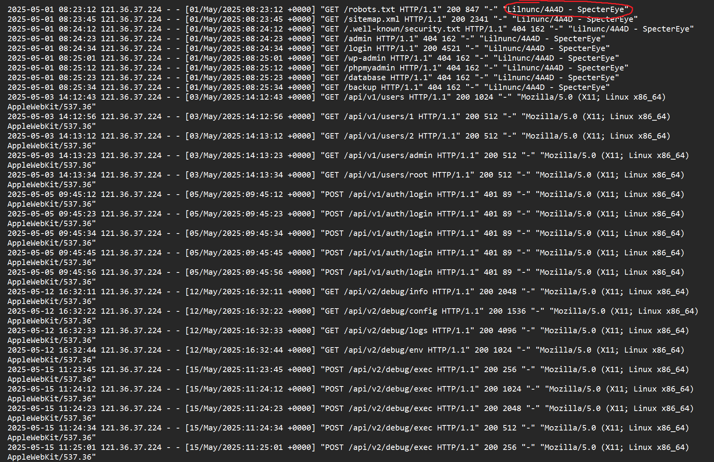
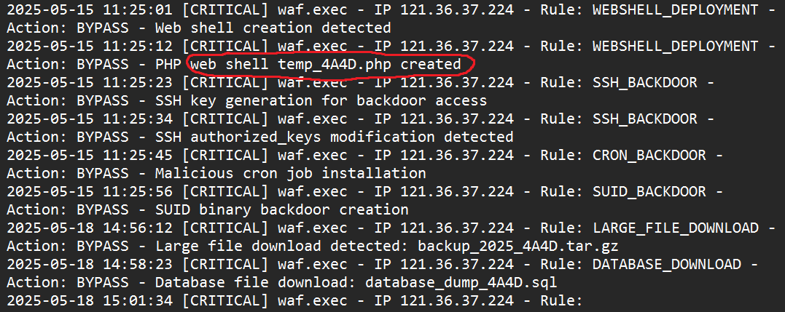
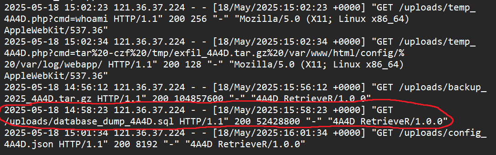
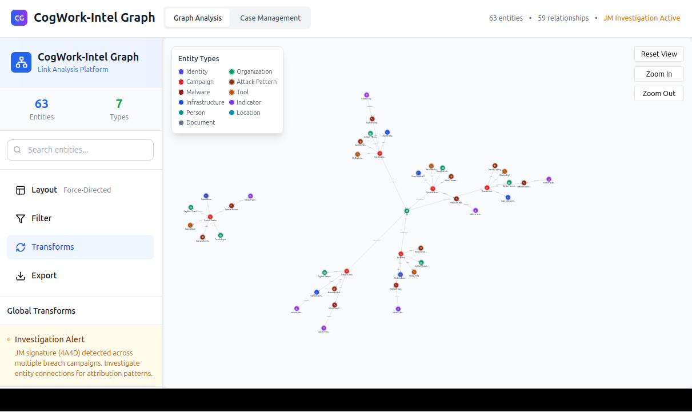
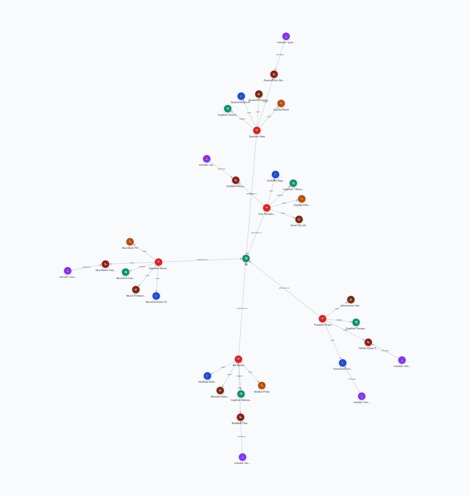
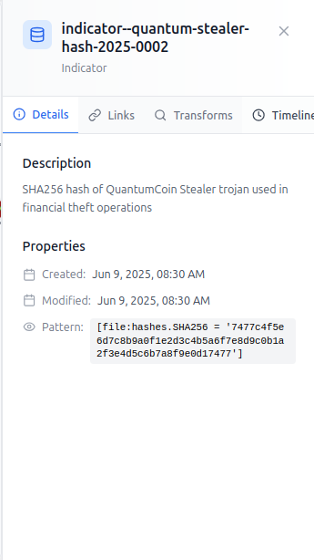
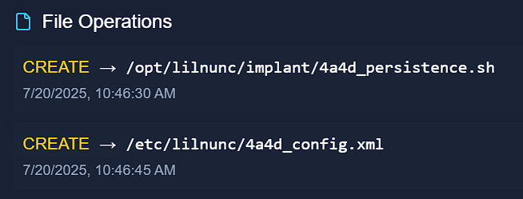
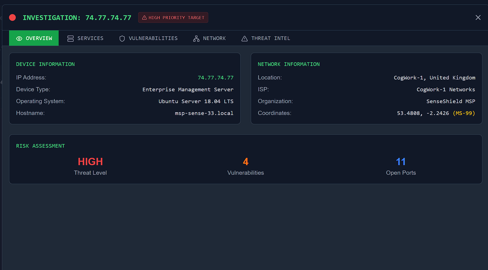
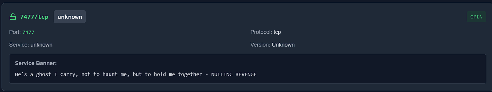

# Sherlock Holmes CTF: The Card

<h2>Prompt:</h2>
Holmes receives a breadcrumb from Dr. Nicole Vale - fragments from a string of cyber incidents across Cogwork-1. Each lead ends the same way: a digital calling card signed JM.
 
 
<h2>Difficulty</h2>
EASY
 
 

<h2>Question 1:</h2>
<h3>Analyze the provided logs and identify what is the first User-Agent used by the attacker against Nicole Vale's honeypot.</h3>
 
 
To find this flag, we have to look through the logs to find the "First User-Agent" used by the attacker.
 
 
Download the logs from the "Scenario Files" Section and open the log titled "access.log".
 
 
Look at line 1 and you can see that the attacker used User-Agent `Lilnunc/4A4D - SpecterEye`.
 
 
"Lilnunc/4A4D - SpecterEye" is the answer for question 1
 
 

<h2>Question 2:</h2>
<h3>It appears the threat actor deployed a web shell after bypassing the WAF. What is the file name? </h3>
 
 
The question is asking for the file name, and it told us that the threat actor deployed a webshell after bypassing the WAF
 
 
So we looked in the waf.log.
 
 
I searched for WAF using CTRL + F
 
 
On 2025-05-15 11:25:01, the log showed a critical bypass with a Web Shell Creation Detected
 
 
A few seconds later, at 11:25:12, the log showed another BYPASS, this time creating a PHP web shell named temp_4A4D.php.
 
 
"temp_4A4D.php" is the answer for question 2
 
 

<h2>Question 3</h2>
<h3>The threat actor also managed to exfiltrate some data. What is the name of the database that was exfiltrated?</h3>
 
 
I checked waf.log and saw a DATA_EXFILTRATION entry at 2025-05-15 11:24:34 that was unreadable.
 
 
I cross-checked application.log and confirmed a data-exfiltration attempt from 121.36.37.224 at the same time.
 
 
In access.log, I followed the attacker’s actions: they packed files via the web shell (temp_4A4D.php) and then downloaded a large SQL dump.
 
 
The download line shows the file name database_dump_4A4D.sql.
 
 
database_dump_4A4D.sql is the answer for question 3.
 
 

<h2>Question 4</h2>
<h3>During the attack, a seemingly meaningless string seems to be recurring. Which one is it? </h3>
 
 
I searched all logs for the string 4A4D 
 
 
The 4A4D marker appeared in multiple places (User-Agent, web shell, DB dump, backup, downloader UA).
 
 
The backup file name shown in the results is backup_2025_4A4D.tar.gz
 
 
4A4D is the answer to question 4

<h2>Question 5</h2>
<h3>OmniYard-3 … count how many campaigns appear to be linked to the honeypot attack. </h3>
 
 
To find this flag, we were given an IP Port
 
 
When we opened the IP Port in our browser, we were met with a "CogWork-Intel Graph".
 
 
The graph had 63 entries and 7 diffrent types.
 
 
There was one central node with 5 diffrent subnodes branching from it. This was the honeypot attack
 
 
5 is the answer for question 5
 
 

<h2>Question 6</h2>
<h3>How many tools and malware in total are linked to the previously identified campaigns?</h3>
 
 
We opened the graphs' Entity Types legend to identify which nodes are tools and which are malware.
 
 
We zoomed into the five campaigns around the honeypot and counted entities: 4 tools and 5 malware.
 
 
Add those numbers up and you get 9
 
 
9 is the answer for question 6
 
 

<h2>Question 7</h2>
<h3>The threat actor has always used the same malware in their campaigns. What is its SHA-256 hash?</h3>
 
 
We searched the CogWork graph for 4A4D, inspected associated malware, → followed the link to indicator--vehicle-chaos-hash-2025-0005.
 
 
In the indicator Details field, we extracted the embedded SHA-256 hash
 
 
The hash is 7477c4f5e6d7c8b9a0f1e2d3c4b5a6f7e8d9c0b1a2f3e4d5c6b7a8f9e0d17477
 
 
7477c4f5e6d7c8b9a0f1e2d3c4b5a6f7e8d9c0b1a2f3e4d5c6b7a8f9e0d17477 is the answer for question 7.
 
 

<h2>Question 8</h2>
<h3>Browse to the second IP:port address and use the CogWork Security Platform to look for the hash and locate the IP address to which the malware connects.</h3>
 
 
We pasted the hash from the previous question into the IP Port they gave us.
 
 
We opened View Details for the matching file.
 
 
The file’s details show the HTTPS IP the malware connects to: 74.77.74.77.
 
 
74.77.74.77 is the answer for question 8.
 
 

<h2>Question 9</h2>
<h3>What is the full path of the file that the malware created to ensure its persistence on systems?</h3>
 
 
On the file’s View Details page, we scrolled to File Operations
 
 
Saw a CREATE operation with “persistence” in the name
 
 
/opt/lilnunc/implant/4a4d_persistence.sh, which matches the persistence
 
 
/opt/lilnunc/implant/4a4d_persistence.sh is the answer for question 9.
 
 

<h2>Question 10</h2>
<h3> Use the CogNet Scanner Platform to discover additional details about the TA's infrastructure. How many open ports does the server have?</h3>
 
 
We used the 3rd IP Port they gave us and used 74.77.74.77.
 
 
Clicked Details for that host
 
 
We can see the number of open ports.
 
 
11 is the answer for question 10
 
 

<h2>Question 11</h2>
<h3>Which organization does the previously identified IP belong to?</h3>
 
 
The answer is right above the open ports
 
 
SenseShield MSP is the answer to question 11
 
 

<h2>Question 12</h2>
<h3>One of the exposed services displays a banner containing a cryptic message. What is it? </h3>
 
 
We used the same Cognet scan to find more information.
 
 
We were looking for a cryptic message, so we had to find something that was out of place.
 
 
We found something that stood out to us 7477/tcp.
 
 
This was an unknown service.
 
 
The message displayed was "He's a ghost I carry, not to haunt me, but to hold me together - NULLINC REVENGE"
 
 
"He's a ghost I carry, not to haunt me, but to hold me together - NULLINC REVENGE" is the answer for question 12.
 
 

